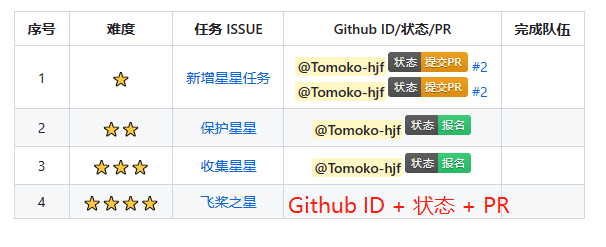

# 黑客松小助手RFC

## 📄 背景

💡💡💡 `Hackathon5`开赛在即，本次大赛会有上百个赛题等着大家攻克，但统计这些赛题的报名信息和当前进度是一项繁重的工作 (感谢 @花花！🍻)。

如果有一个小助手💡可以帮助我们自动统计和展示赛题进度，那自然是极好的，所以`黑客松小助手`它带着期盼走来了!🎉🎉🎉

## 🚩 功能

`黑客松小助手`目前的主要功能如下，欢迎各位大佬前来补充：

* 根据issue回复自动填写报名信息，完成任务认领。
* 根据提交的PR状态，自动更新issue中表单信息，完成状态变更。
* 汇总所有的赛题，形成总体看板。

## 🚩 实现方案

### 🚀 状态

在比赛期间，我们为参加比赛的大佬们设置了`五种状态`（如下），整体状态的变更顺序为：`报名状态` -> `提交RFC` -> `完成设计文档` -> `提交PR` -> `完成任务`。 

|     状态名称     |                           状态标志                           |          状态说明           |
| :--------------: | :----------------------------------------------------------: | :-------------------------: |
|     报名状态     |   | 表明通过issue评论区进行报名 |
|   提交RFC状态    |  |   表明已经提交设计方案RFC   |
| 完成设计文档状态 |  |    表明已经完成设计文档     |
|    提交PR状态    |  |       表明已经提交PR        |
|   完成任务状态   |  |      表明已经完成任务       |

### 🚀 榜单设计

为了更好地展示赛题进度，我们设计了榜单。整体的榜单设计如下，比赛进行期间，小助手会自动更新`Github ID/状态/PR`栏和`完成队伍`栏信息。



`Github ID/状态/PR`栏内容的格式为`Github ID + 状态 + Pr`，其中`PR`可以有多个，`赛题参加人数`也可以有多个，以回车`<br>`分隔。

### 🚀 报名信息监控

考虑到报名赛题不会产生任何`PR`，所以通过`评论`来实现此功能，其他状态均可以通过监控`PR`实现。

#### 实现逻辑

通过监控`issue`下的评论完成报名信息监控，实现逻辑如下：

* 获取`issue`下评论。
* 从评论中抽取报名信息，比如`Github ID`、`报名赛题编号`等信息。
* 更新`issue`中个人报名信息，将个人状态更新为`报名状态`。

#### 报名格式

为了自动填写报名信息，需要在`issue`下回复报名信息，格式如下：

```
【状态】: 报名
【序号】：2、3
```

> 其中`【状态】: 报名`表示当前评论是赛题`报名`，`序号`表示报名的赛题序号，多个赛题之间需要用`中文顿号、`分隔。

### 🚀 其他状态变更监控

除`报名状态`外，剩下`四种状态`的变更可以通过监控`PR`的状态来完成, 具体的实现逻辑如下：

* 获取指定仓库下黑客松`开始之后`标题中包含`Hackathon No.`字样的所有`PR`，具体是`bot.py`文件的`repo_urls`变量下的所有仓库。
* 如果`PR`是`PaddlePaddle/community`仓库下的，说明该PR与设计文档有关。继续判断是否`merge`，如果未`merge`，说明状态为`提交RFC`；如果已经`merge`，说明状态为`完成设计文档`。
* 如果`PR`不是`PaddlePaddle/community`仓库下的，说明该`PR`与提交代码有关。继续判断是否`merge`，如果未`merge`，说明状态为`提交PR`；如果已经`merge`，说明状态为`完成任务`。
* 每次更新后的issue内容将会保存在`logs`文件夹下，文件名是更新日期。

> 对于人工处理的赛题，可以将赛题题号加入`utils.py`文件的`un_handle_tasks`变量中，小助手不会处理这些任务。


#### PR格式

为了完成状态变更，只需要在`PR`的标题中以`【Hackathon No.xxx】`开头即可，程序会自动提取赛题编号并更新榜单。

## 🚩 代码结构

整体的代码文件分为两个：

* `utils.py`：负责拉取评论和PR、根据评论更新状态、根据PR更新状态。
* `bot.py`：小助手整体运行逻辑。

## 🚩 运行方式
1、替换`utils.py`文件中的`Github token`；替换`bot.py`文件中的`issue_url`和`repo_urls`,代表监控的issue链接和仓库链接；

2、如果不开代理，请将`utils.py`文件中`proxies`置为`None`；

3、执行如下命令，代码会每两小时更新一次issue，每次更新后的issue内容会保存在`logs`文件夹下；
```shell
cd HackathonBot

python bot.py
```

## 🚩 未来规划

* **预警功能**：自动提醒每个赛题的状态，针对长时间没有变更状态的赛题进行预警。

* **看板功能**：后期可以扩展看板功能，进行数据分析，更好的量化开发者的贡献，类似于 [openGauss 贡献看板](https://datastat.opengauss.org/zh/overview) [一款开源的开源社区贡献看板](https://ost.51cto.com/posts/14589)。


