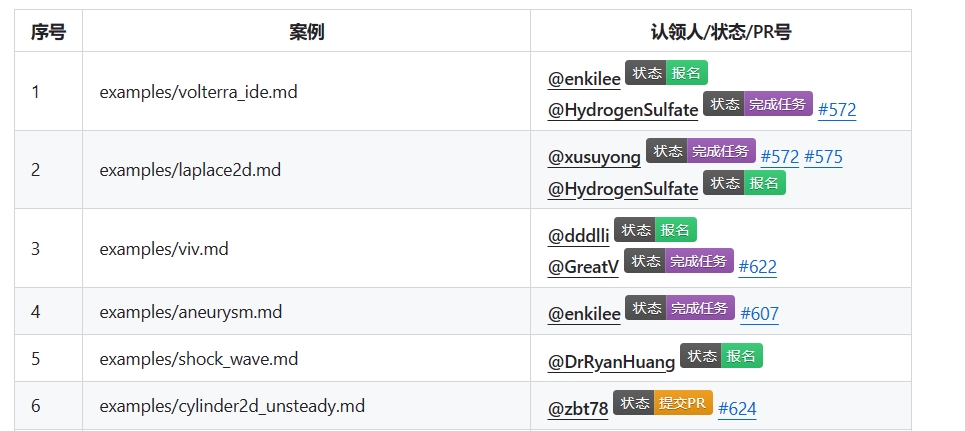

# 配置使用手册

## 总体概述
为了监控多个快乐开源任务，可以在`config.py`文件下指定多个开源任务配置。

## 快速使用示例
以下是一个简单示例：

### 表格格式
issue中表格需要按照下图配置


参考范例：
- https://github.com/PaddlePaddle/PaddleScience/issues/571 
- https://github.com/PaddlePaddle/Paddle/issues/58067 

注意事项：
* 序号前后各有一个空格，举例 `| 10 |`。
* 赛题状态目前默认为第`3`列，表头信息可以自行修改。如果不是第`3`列，需要在配置文件中指定`pr_col`字段，表示赛题状态所在列，列数从`1`开始。
* 看板信息和统计信息，默认加在`issue`内容的最后（推荐默认方式）

### 配置文件格式
该示例中指定了`任务名称`，`issue链接`，`任务数量为20个`，该任务相关的PR包含`hydra No.`前缀，`赛题状态在第三列`等信息。
```python
{
    # 任务名称，起标识作用
    'issue_name': "【快乐开源】基于hydra的案例改造计划",

    # 开始时间，只会统计开始时间之后的PR(注意时间中的字母T和Z不能缺少)
    'start_time' : '2023-10-16T00:28:48Z',

    # issue页面 url 地址, 注意结尾不要有斜杠
    'issue_url': 'https://api.github.com/repos/PaddlePaddle/PaddleScience/issues/571',
    
    # 监控的仓库列表
    'repo_urls': ['https://api.github.com/repos/PaddlePaddle/PaddleScience/pulls'],

    # 总的任务数量
    'task_num' : 20,

    # 忽略不处理的题号，这部分留给人工处理
    'un_handle_tasks' : [],

    # 已删除的赛题
    'removed_tasks' : [],

    # 赛道名
    'type_names' : ["热身赛"], 

    # 每个赛题所属的赛道，每个赛道是一个数组
    'task_types' : [['1-20']],

    # 该issue相关PR的前缀，用来标识PR是否属于该issue
    'pr_prefix' : "hydra No.",

    # PR、状态等信息所在的列
    'pr_col': 3,
}
```
配置文件格式的参考范例 & 对应的表格格式：
- https://github.com/PFCCLab/PaddleAutoProject/pull/49 对应 https://github.com/PaddlePaddle/Paddle/issues/58067
- https://github.com/PFCCLab/PaddleAutoProject/pull/51 对应 https://github.com/PaddlePaddle/Paddle/issues/58237

配置文件注意事项：
* 赛题状态列默认是第三列，如果不是第三列，需要在赛题配置中指定`pr_col`字段，表示赛题状态所在列，列数从`1`开始。
* 如果需要指定赛题完成人，需要在赛题配置中指定`complete_col`字段，表示完成人信息所在列，列数从1开始。

## 详细配置项
配置分为两种，一种是基础配置`common_config`，包括多个任务共用的一些信息，比如`用户token`等信息，每个字段的具体含义如下：
* issue_token：具有修改`issue`权限的`token`。
* comment_token: 具有评论权限的`token`。
* proxies：代理地址。
* board: 是否展示看板信息，默认展示。
* comment_to_user_list：对于报名格式不正确用户的保存，保持为空即可。

除了基础配置，每个任务都会有一个特有的配置对象，该对象每个字段的含义如下：
* issue_name：任务名称，用于标识任务。
* start_time：任务开始时间，只会统计开始时间之后的PR(注意时间中的字母T和Z不能缺少)。
* issue_url：黑客松 `issue`页面 `url` 地址, 注意结尾不要有斜杠，前缀为`api.github.com`。
* repo_urls：监控的仓库列表。
* un_handle_tasks： 忽略不处理的题号，这部分留给人工处理。
* removed_tasks：已删除的赛题。
* type_names： 赛道名，一个开源任务可以有一个或多个赛道。
* task_types：每个赛题所属的赛道，每个赛道是一个数组，对于多个赛题，数组中可以使用横线标识区间，比如 `['1-20']`表示赛题1到20。
* pr_prefix: `PR`标题所要包含的前缀，标识该赛题的相关PR。
* pr_col(可选)：PR、状态等信息所在的列，默认是第3列。如果需要自定义，需要在赛题配置中指明该字段，列数从`1`开始。
* complete_col(可选): 如果需要标识赛题完成人，需要写上完成人所在的列。

> 属性覆盖：可以在特定配置对象中覆盖基础配置中的属性，即两个配置对象都配置了同一字段，则会以特定配置对象中字段为准。
