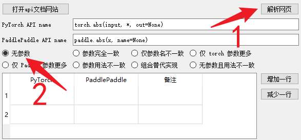
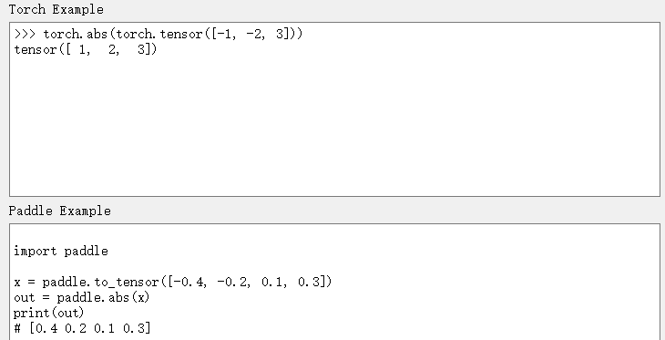
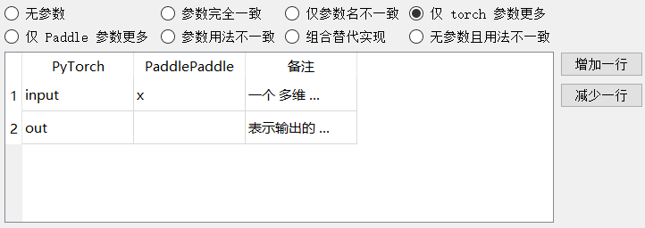
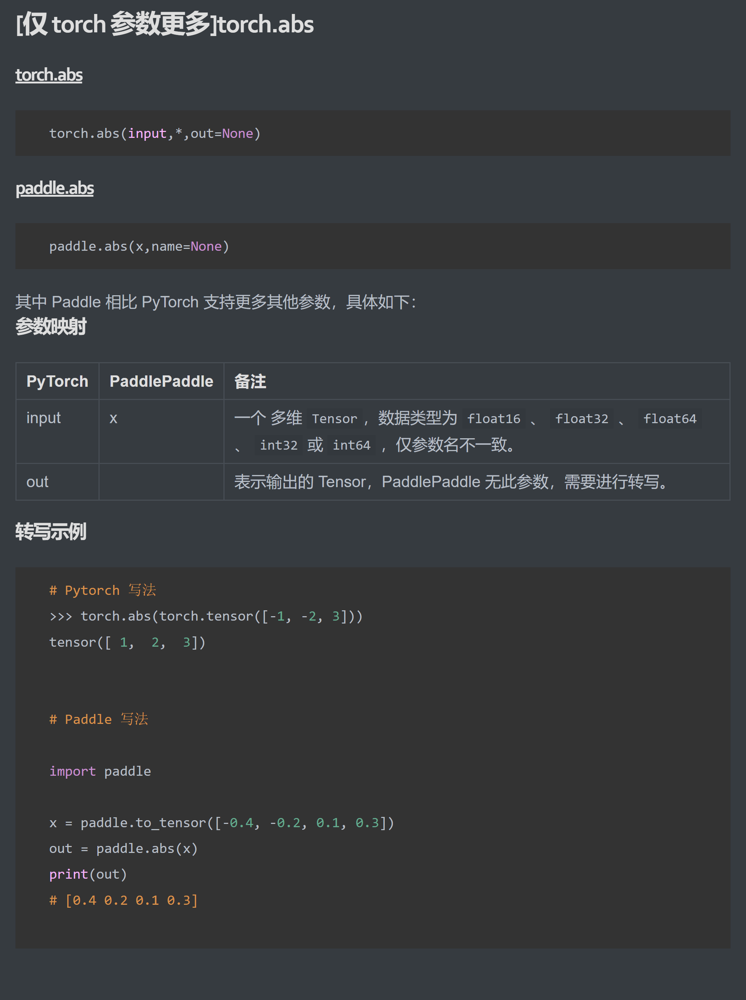

# PyTorch与Paddle文档映射辅助工具

具体起源与需求见 https://github.com/PaddlePaddle/docs/issues/5691

## Call for Contributor

https://github.com/PFCCLab/PaddleAutoProject/issues/13

## 已知问题

打包后的 macos app 打不开的话需要手动给权限才能运行 `chmod +x Pytorch2PaddleDocsTools.app/Contents/MacOS/Pytorch2PaddleDocsTools`

## 如何使用？

### 一、配置环境

1. 首先将PaddleAutoProject克隆到本地

~~~shell
# 在Git bash内
git clone https://github.com/PFCCLab/PaddleAutoProject.git
~~~

2. 打开自己的IDE，并进入到Pytorch2PaddleDocsTools文件夹下

~~~shell
cd .\xxx\PaddleAutoProject\Pytorch2PaddleDocsTools
~~~

3. 下载所需依赖

~~~shell
pip install -r requirements.txt
~~~

4. 一键启动项目~

~~~shell
python .\main.py
~~~

### 二、如何从 0 开始完成一个文档任务

如果我们正常打开项目，可以看到以下界面，下面将以此介绍其功能。

- Save Directory：最终写出文件的保存路径，默认为当前目录下
- PyTorch API url：所需修复文档的PyTorch API 链接
- PaddlePaddle API url：所需修复文档的PaddlePaddld API 链接

#### 1.查找所需 API 的url

当我们点击工具中的`打开api文档网站`按钮，可以进入Paddle与Pytorch的官方文档，此时可以搜索我们所需要修改的API，例如案例中的`abs`。

当按照图上顺序点击后，此时网页上方出现的URL即为我们所需填写的URL，可以将其填写在`PyTorch API url`与`PaddlePaddle API url`框内。

#### 2.解析网页并判断文档映射类型

由于abs文档属于无参数映射关系，故可以先选择其类型，并且点击解析网页。

后得到解析成功后的结果：

若解析有误，可以自行点击上方图中`增加一行`/`减少一行`进行调整，当出现参数有差异的情况，并可补充备注。

对于需要进行转写的案例，本工具也自动填充了示例代码模板（如下图），需要用户手动修改，使得两边的运算结果成为等量映射。

由于参数`name`是用户无需关注的参数，因此需要去除，而`abs`的PyTorch案例则多出`out`这个参数，故判断类型为`仅torch参数更多`。

当选择好映射类别，并且将所需参数类型进行对应以及写好备注之后，可以尝试直接点击工具右下角`写文件`进行文本导出，导出路径即为`Save Directory`所配置路径。

现在我们就可以将已经生成好的文档映射用来提交PR啦~~

PS：如果生成的不好，可以直接手动修改md文件(bushi)，也可以将您觉得不方便的点提issue让我们来解决，再或者是您提PR帮我们完善！！！

感谢使用Pytorch2PaddleDocsTools。